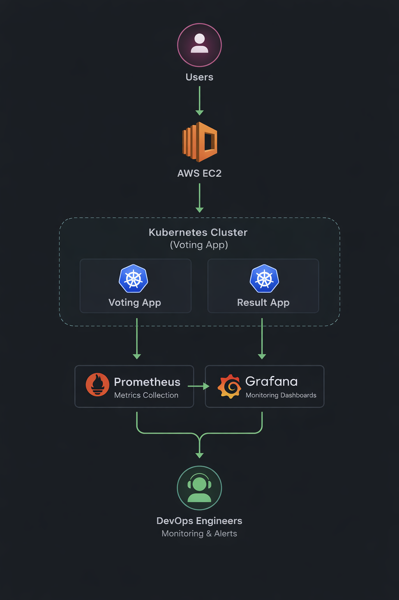
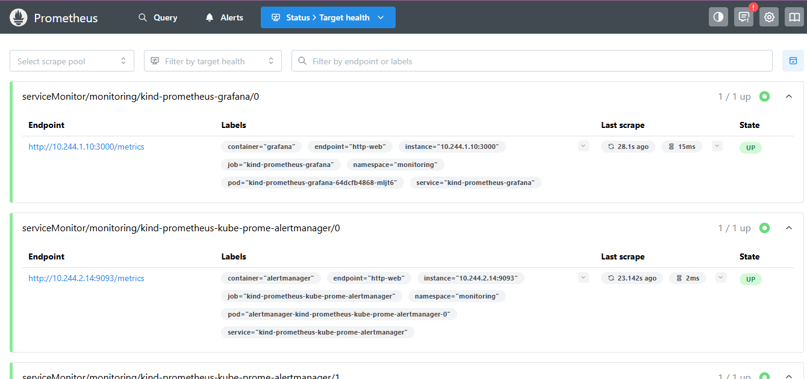
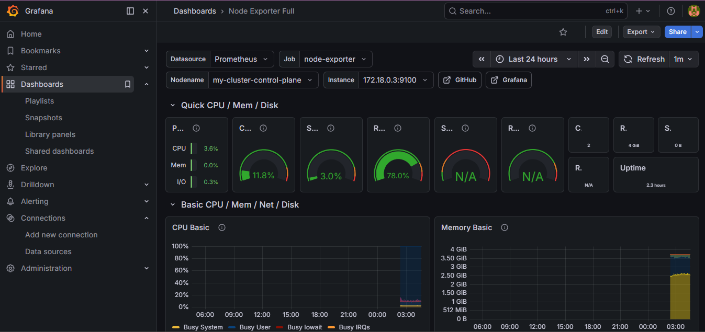
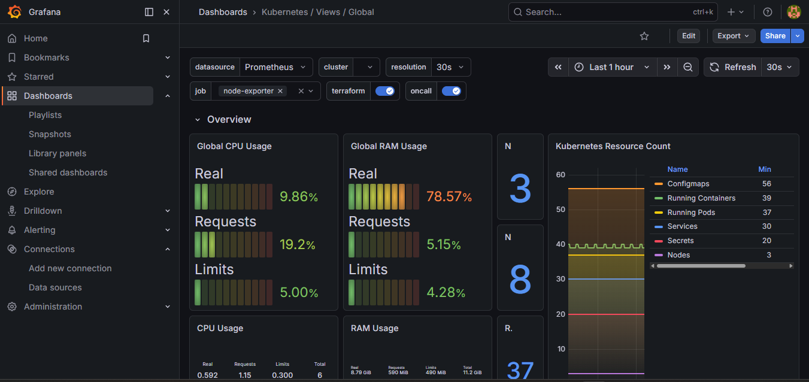

# 🚀 Kubernetes Observability with Prometheus & Grafana


---

## 📌 Overview

This project demonstrates how to implement **Kubernetes observability** using **Prometheus and Grafana**.

The monitoring stack collects real-time metrics from Kubernetes nodes and pods and visualizes them through powerful dashboards.

This repository is part of a **complete DevOps workflow** including:

* ⚙️ Infrastructure provisioning with Terraform
* ☸️ Kubernetes cluster deployment
* 🔄 GitOps deployment using ArgoCD
* 📊 Monitoring using Prometheus & Grafana

---

## 🏗 Architecture



---

## 🧰 Tech Stack

| Tool          | Purpose                    |
| ------------- | -------------------------- |
| ☸️ Kubernetes | Container orchestration    |
| 🔥 Prometheus | Metrics collection         |
| 📊 Grafana    | Monitoring dashboards      |
| 📦 Helm       | Kubernetes package manager |
| 🐳 Docker     | Containerized applications |
| ☁️ AWS EC2    | Cloud infrastructure       |

---

## 🔍 Observability Components

### 🔥 Prometheus

Prometheus is a **time-series database and monitoring system** used to collect metrics from Kubernetes components.

Features:

* 📡 Metrics scraping
* ⏱ Time-series database
* 🧠 PromQL query language
* 🔎 Kubernetes service discovery

Example PromQL query:

```
sum(rate(container_cpu_usage_seconds_total{namespace="default"}[1m])) / sum(machine_cpu_cores) * 100
```

---

### 📊 Grafana

Grafana is used for **visualizing metrics collected by Prometheus**.

Dashboards used in this project:

* 📈 Node Exporter Dashboard
* ☸️ Kubernetes Cluster Dashboard

These dashboards show:

* CPU usage
* Memory usage
* Disk usage
* Network traffic
* Running pods
* Cluster resource utilization

---

## 📷 Screenshots

### Prometheus Metrics Query



### Grafana Node Exporter Dashboard



### Kubernetes Cluster Monitoring Dashboard



### Voting Application


---

## 🧠 Learning Outcomes

Through this project I learned:

* Kubernetes observability principles
* Prometheus metrics scraping
* Writing PromQL queries
* Grafana dashboard creation
* Kubernetes cluster monitoring

---

## 🚀 Future Improvements

* 🔔 Alerting with Alertmanager
* 📜 Log monitoring with Loki
* 🔍 Distributed tracing with Jaeger
* 📊 Application-level metrics

---

## 👨‍💻 Author

**Mohammed Abdul Faizan**
DevOps & Cloud Enthusiast
